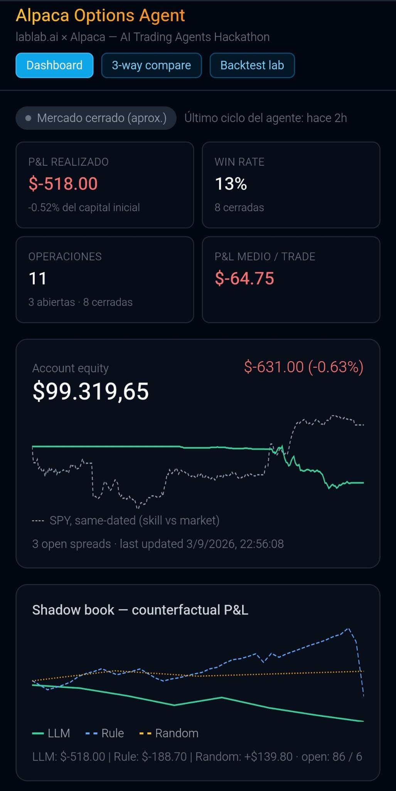
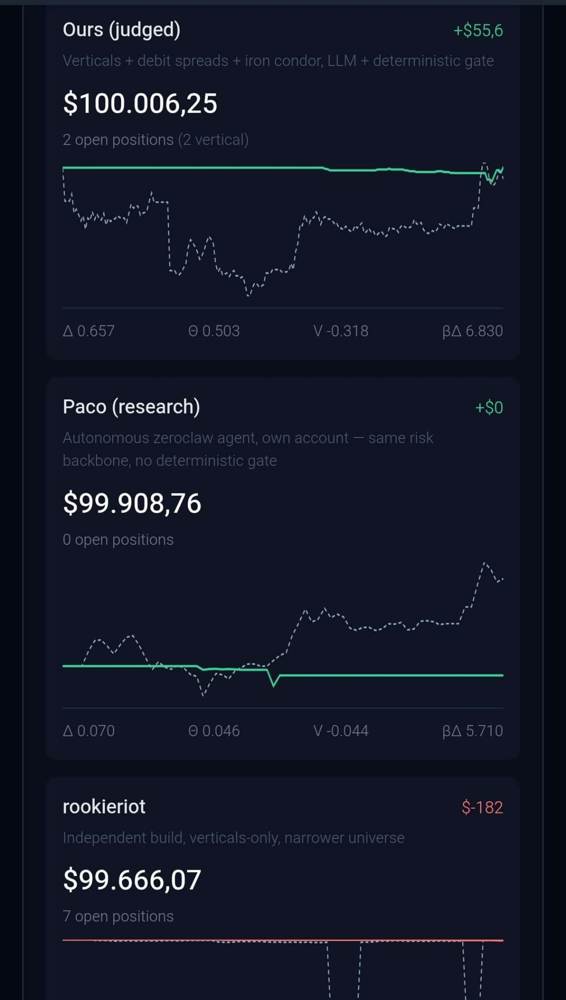

# Alpaca Options Credit-Spread & Iron-Condor Agent — One-Pager

> **Not one trading bot — three, run as a controlled experiment.** One shared,
> imported `risk_gate.py`; three different answers to *"how much should the LLM
> decide?"*; compared live on a public dashboard, with the unedited ledger below.

**At a glance:** 51 Python modules · **100% of option reads and orders through
Alpaca's official MCP server** (never the raw SDK) · a deterministic risk gate
with **a dozen-plus hard checks the LLM cannot override** · self-computed delta / IV-rank /
VIX proxies (this data tier supplies none), each labelled a proxy in code *and*
UI · a live Supabase-backed dashboard, web **and** Telegram Mini App · a
~100-case chaos + unit test suite · a nightly parameter-evolution job
(report-only during judging) · a shadow-book ablation against a mechanical rule
and a coin-flip baseline.

**Links:** [live dashboard](https://alpaca-agent-dashboard.vercel.app) ·
[3-way `/compare`](https://alpaca-agent-dashboard.vercel.app/compare) ·
[`docs/STRATEGIES.md`](docs/STRATEGIES.md) — the full three-implementation write-up.

*lablab.ai × Alpaca "AI Trading Agents" Hackathon (28 Aug – 4 Sep 2026,
deadline 2026-09-04 15:00 UTC). Judged on P&L, technology implementation,
creativity/originality, and presentation. This account was reset to a
fresh $100,000 paper account on 2026-08-30 (see "Honest scope notes"), so
the Results section below reflects a handful of real trading days, not a
full week.*

## The experiment: three decision architectures, one shared risk floor

Core hypothesis (falsifiable, not assumed true): *given an identical,
risk-filtered candidate menu, can timestamped unstructured context (an LLM)
improve option selection over a structured-only selector, without
increasing predefined risk?* We do not claim "LLM agents produce alpha" —
the profitability question is the open experiment, not a premise.

Rather than build one bot and hope, our three-person team ran **three**
separate live paper-trading agents in parallel, all enforcing the exact
*same* deterministic `risk_gate.py` logic (shared/imported, never
reimplemented per agent) — so any behavioral difference reflects how much
decision freedom the LLM was given, not a different risk tolerance:

| | **This submission** ("bot juzgado") | **rookieriot** (teammate Will) | **Paco** (zeroclaw agent) |
|---|---|---|---|
| Structure | credit verticals + iron condors, regime-routed | credit verticals only | whatever the agent itself decides |
| Decision flow | code builds a pre-gated candidate menu → LLM *selects from it* | same pattern (candidate menu → LLM select) | no menu — full Alpaca MCP tool access, agent picks underlying/structure/strikes/size itself |
| Risk enforcement | candidates that fail the gate never reach the LLM | same | every `place_option_order` call is intercepted and checked *after* the agent decides, via a dedicated MCP proxy |
| Account (paper) | PA36EFWLOWRF | PA34CFYP0MIZ | PA34KZNBKA4L |

Paco is the sharpest test of the hypothesis, architecturally: it runs as an
autonomous zeroclaw agent (model: mimo-v2.5-pro, unbounded runtime) wired
to Alpaca's real MCP toolset, with **no pre-built candidate menu at all**.
A purpose-built `mcp_risk_proxy` (its own small repo, importing this
project's `risk_gate.check_new_spread` unmodified rather than
reimplementing it) sits transparently between the agent and the real
`alpaca-mcp-server`: every other tool call (quotes, account info, order
history) passes straight through, but `place_option_order` is parsed
(2-leg → vertical, 4-leg → iron condor), priced from live mid quotes, and
rejected outright if it would breach the same per-spread loss cap,
concentration cap, or iron-condor exposure cap this submission enforces
*before* generating a candidate. Same hard floor, opposite order of
operations: **gate-then-decide** (this submission, rookieriot) vs.
**decide-then-gate** (Paco).

## AI logic

- **Screening → regime → structure.** A liquid ~500-ticker universe (reused,
  tested code from an independently-run equities system) feeds a trend
  filter (EMA/ADX), then a 4-regime classifier (`signals/regime.py`, ADX vs
  25 and 20d/60d realized-vol ratio vs 1.5x):
  - TRENDING / VOLATILE_TRENDING → directional **credit vertical** (bull put
    on a long signal, bear call on a short signal), with a stricter debit-
    spread overlay (ADX > 35 + a real signal-strength floor) tried first on
    high-conviction trends.
  - RANGING → non-directional **iron condor** (put spread + call spread,
    same expiration/width) — candidates with no real trend backing them are
    routed here instead of forced into a directional bet or discarded. Falls
    back to a directional vertical on the same signal if the iron condor
    can't clear its own credit floor.
  - VOLATILE_RANGING → skip (elevated vol with no trend — the conservative
    cell of the matrix, deliberately not traded).
- **Entry filter.** A realized-volatility-percentile check (proxy for IV
  rank — see next section) plus scheduled macro-event blackout windows
  (JOLTS, NFP) that block new entries around known high-impact releases
  without touching exits.
- **LLM decision layer** (mimo-v2.5-pro, OpenAI-compatible endpoint) sits
  *on top of* the deterministic risk gate, not instead of it — it only ever
  sees candidates that already passed every hard check, and chooses which
  (if any) to act on within the remaining concurrent-spread budget. Every
  candidate carries short `fact_ids` (e.g. `AAPL_CREDIT_EST`) and the model
  must cite them (`[FACT_ID]`) for every number in its reasoning —
  uncited/unknown citations are logged, making the reasoning auditable
  rather than trusted at face value.
- **Shadow book.** Every real cycle also runs a mechanical rule-based
  policy, a matched-rate random policy, and two LLM stop-loss variants
  against the *same* gate-approved candidates, tracked as virtual positions
  with real mark-to-market P&L — see Results for current numbers.

## Risk gates (hard backstop in code — the LLM cannot override any of this)

- Per-spread max loss ≤ 2% of equity; daily loss circuit breaker at -3%;
  max 7 concurrent spreads overall, max 2 concurrent iron condors with a
  separate 30%-of-equity aggregate cap (4-leg structures consume more
  liquidity/concentration budget per position than a vertical).
- DTE window enforced on every entry (currently 7-14, see scope note below
  on an unresolved internal disagreement with our own backtest).
- Per-underlying concentration cap (20% of equity) **and** a
  correlation-cluster cap (40%, mega-cap tech / big banks / energy majors —
  see next section) — the cluster cap exists specifically because several
  "different" names can still be one correlated bet in a stress move.
- Per-leg liquidity gate (bid-ask ≤ 12% of mid, open interest ≥ 100 when the
  feed reports a value) and a fresh-quote re-check immediately before every
  order — a missing or stale quote timestamp blocks the trade rather than
  being treated as "fine" (fail-closed, not fail-open).
- Entries and exits use **marketable limit orders**, never unbounded market
  orders — accepts no worse than 10% slippage off the just-checked
  credit/debit, with real fill confirmation (poll up to 45s; an order that
  never fills is cancelled and the cycle fails rather than leaving a
  position open at an unvalidated price).
- `should_force_close`: an unconditional exit once DTE ≤ 1 or the contest
  deadline is within 2 hours, independent of profit/loss — so a late-week
  entry can't end the contest open and undemonstrated.
- Independent broker-vs-database **reconciliation** every cycle — compares
  real Alpaca option legs against the local position ledger by symbol,
  quantity, *and* signed side (not just "does this symbol exist somewhere"),
  aggregated across all open rows per symbol so two identical structures
  opened separately don't false-positive against each other — and blocks
  new entries on any mismatch until a human resolves it.
- Manual (`emergency_flatten.py`) and automatic (`kill_switch.py`) circuit
  breakers, independent of the per-cycle gate above.
- A hard runtime guard refuses to proceed if the credentials that resolve
  at runtime ever point at *either* team instance's other real judged
  account (added after a real cross-account display incident, 2026-08-30) —
  an account-identity mistake is exactly the class of error a log line gets
  scrolled past, so this is a hard stop, not a warning.

## Data Alpaca doesn't provide — computed in-process

This account's data tier (free/indicative feed, no Algo Trader Plus
subscription) is missing several inputs a fully-provisioned options bot
would just read from the broker. Rather than skip the checks or fake the
number, each is computed from data Alpaca *does* provide, and labeled as a
proxy everywhere it's surfaced (code, dashboard, this doc) rather than
overclaiming:

- **Delta** — confirmed live that the options snapshot has no `greeks`
  field on this feed (OPRA/real Greeks require a paid plan).
  `black_scholes.py` computes delta in closed form, using realized
  volatility (below) as the IV input.
- **IV rank proxy** — no real implied-vol history on this tier either.
  The entry filter ranks the *current* 20-day ATR% against its own trailing
  year — a realized-vol percentile, an explicit proxy for IV rank, not the
  real thing.
- **VIX proxy** — Alpaca's data API has no `^VIX`. A VIXY-percentile
  overlay stands in for a market-wide vol-of-vol regime signal, used to
  widen or tighten iron-condor strike selection.
- **Portfolio beta-weighted delta** — "this book moves like N shares of
  SPY" isn't broker-supplied. `portfolio_greeks.py` computes it from the
  in-process Black-Scholes deltas on currently-held legs and a real
  trailing-return beta per underlying computed from daily bars — never a
  hardcoded beta table — shown on the dashboard for monitoring only (never
  gates a decision).
- **Correlation clusters** — Alpaca has no sector/correlation API.
  `screening/correlation_clusters.py` hand-curates three well-documented
  correlated groups (mega-cap tech, big banks, energy majors) from public
  market-structure knowledge — deliberately not a full sector taxonomy,
  scoped to the names this project's own screening universe actually
  surfaces — feeding a concentration cap the per-underlying cap alone
  can't catch.

## Alpaca infrastructure

- **100% of options reads and writes go through Alpaca's official MCP
  server** (`get_option_contracts`, `get_option_snapshot`,
  `place_option_order`) — the raw SDK is never used for anything
  options-related. The zeroclaw/Paco variant reuses the *same* upstream MCP
  server, just behind our own validating proxy (see above).
- Orchestration via a cron job on an adaptive schedule (2-30 minutes,
  tightening automatically near a stop-loss and backing off when idle and
  quiet, rather than a fixed interval) plus a real-time WebSocket monitor
  for open verticals, started/stopped daily around market hours (iron
  condors are deliberately excluded from the always-on monitor and handled
  by the cron instead, to avoid a partial-fill/partial-close failure mode
  on a 4-leg structure).
- Supabase/Postgres backing store in its own isolated schema
  (`alpaca_hackathon`), reached via direct Postgres (not the REST API — the
  schema isn't in this Supabase project's exposed-schema list).
- Public dashboard (Next.js, dual web + Telegram Mini App) reading that
  store live: equity curve, open positions, per-cycle reasoning with cited
  facts, the shadow-book comparison, and portfolio Greeks.

## Results

**Profitability is the open question in this experiment, not a claim we are
making — so here is the unedited ledger.** A handful of live paper-trading
days on a freshly reset account (2026-09-03 market-close snapshot, 20:56
UTC): directional, not a verdict, and short enough that variance dominates.
The comparison arms below run the *same* imported risk code, so what differs
is decision architecture, not risk appetite.

**Main view — 2026-09-03 market close** (a down week):

**`/compare` — earlier the same week**, judged account +$55 over its $100k
start, Paco flat, rookieriot down. The equity has traded on both sides of
$100k across the week; the live dashboard is the source of truth, not
either still frame:

**This submission (bot juzgado):**
- Starting equity: $100,000 (2026-08-30 reset)
- Equity 2026-09-03 close: **$99,319.65** — **-0.68%** since the reset,
  **-0.63% on the day** (-$631, of which -$438 realized, ~-$193 open
  mark-to-market)
- 257 cycles run
- 11 spreads opened: **1 closed for profit (+$102, AAPL bull put — the
  first real in-market fill *and* close since the reset)**, 7 stopped out
  (-$620 total), 3 still open (2 AAPL bull puts, 1 UBER bear call).
  Realized to date: **-$518**
- The -$620 of stops is concentrated: **5 of the 7 were bear-call spreads
  on the *same* name (CRWD) on 2026-09-03**, re-entered cycle after cycle
  as the stock kept rising against the short call (-$540). Root cause: the
  gate had a duplicate-*position* check but nothing stopped it re-proposing
  the same underlying+direction right after a stop. Fixed the same
  afternoon — a post-stop re-entry cooldown (blocks that underlying+
  direction for 240 min; iron condors keyed separately). A second fix that
  day closed a path where a spread could get stuck failing to close.
- Two entry-throttle fixes on 2026-09-03 (a stock-price and volume filter
  carried over from the equities strategy, plus the vertical
  credit-to-width floor loosened 0.10 → 0.05) took screening from ~30 to
  ~150 candidates a cycle and got the bot actually trading — the real
  lever for the credit floor (delta vs. width) is still a tagged,
  post-hackathon question, not resolved by the loosening alone.
- Shadow-book ablation (same gate-approved candidates, several policies as
  virtual positions with real mark-to-market P&L): still mostly open and
  too small to read. Realized so far — mechanical baseline -$189 (44
  closed of 130), LLM-no-stop +$150 (3 of 11), LLM-tight-stop -$350 (11 of
  11), random +$140 (5 of 11) — with large open marks against all of
  them. Presented as an honest in-progress ablation, not a conclusion.

**Paco (zeroclaw, decide-then-gate architecture):**
- Starting equity: $100,000; equity 2026-09-03 close: $99,908.76 (-0.09%)
- **One** spread opened since the reset: a MSFT bull put (credit $68),
  accepted by the exact same `risk_gate.check_new_spread` this submission
  uses despite Paco having no pre-built candidate menu — closed at -$91 by
  the independent reconcile job. No trades since.
- The reason it hasn't traded more is friction, not risk: on 2026-09-03,
  of ~69 cron ticks, 21 skipped because a previous turn's lock was still
  held and 6 timed out — the agent was doing per-option Black-Scholes math
  inline and running out of its cycle budget. A batch regime-classification
  fix was deployed ~20:20 UTC that day, too late in the session to confirm;
  it's the thing to watch in the 2026-09-04 session.

**rookieriot (teammate Will, verticals-only):** a separate account and
codebase run day-to-day by Will — not this repo's numbers to report here.
Notable from their side: an equivalent activity-throttling issue (an
overly strict volatility/liquidity floor producing near-zero entries) was
independently diagnosed and recalibrated on their universe on 2026-09-01,
one day before we found and fixed our own version of the same failure
mode.

## Honest scope notes

- **Account reset 2026-08-30**: the account originally used since kickoff
  (28-ago) was replaced with a brand-new $100,000 paper account after
  several risk-gate/parameter changes landed mid-week (limit orders,
  fill confirmation, cluster concentration cap, qty/side-aware
  reconciliation) — we wanted the judged track record measured against the
  final rule set, not a mix of old and new rules. Verified compliant with
  the hackathon's own account rule (a "brand-new, dedicated" account, no
  kickoff-timing requirement in the official text).
- No real IV Rank on this account tier — the realized-volatility-percentile
  filter is a proxy, explicitly labeled as such in code and here, not
  relabeled as the real thing.
- Several thresholds are starting values, not independently backtested
  (correlation-cluster cap, the wider iron-condor width in high-vol-trending
  regimes, the 10% entry-slippage tolerance, the 2026-09-03 credit-to-width
  loosening) — flagged as such in code and watched via a nightly dry-run
  parameter-evolution report (logs what it *would* have changed and why,
  never applies anything automatically) before any of them are allowed to
  move for real.
- The DTE window (7-14) follows an external 3-strategy research spec; our
  own walk-forward backtest found 10-21 outperforms with a large,
  sign-changing difference. Deliberately left as a live, tagged comparison
  (real P&L is recorded per parameter "generation") rather than resolved by
  re-running the backtest a second time.
- Screening universe skews toward large/mid-cap liquid names; the
  correlation-cluster gate mitigates but doesn't eliminate the resulting
  concentration risk.
- The two SMCI losing trades (Results, above) were opened ~10 minutes apart
  with near-identical strikes/expiration — a real duplicate-candidate gap
  since closed (an exact-leg-set check now drops a plan that duplicates an
  already-open position).
