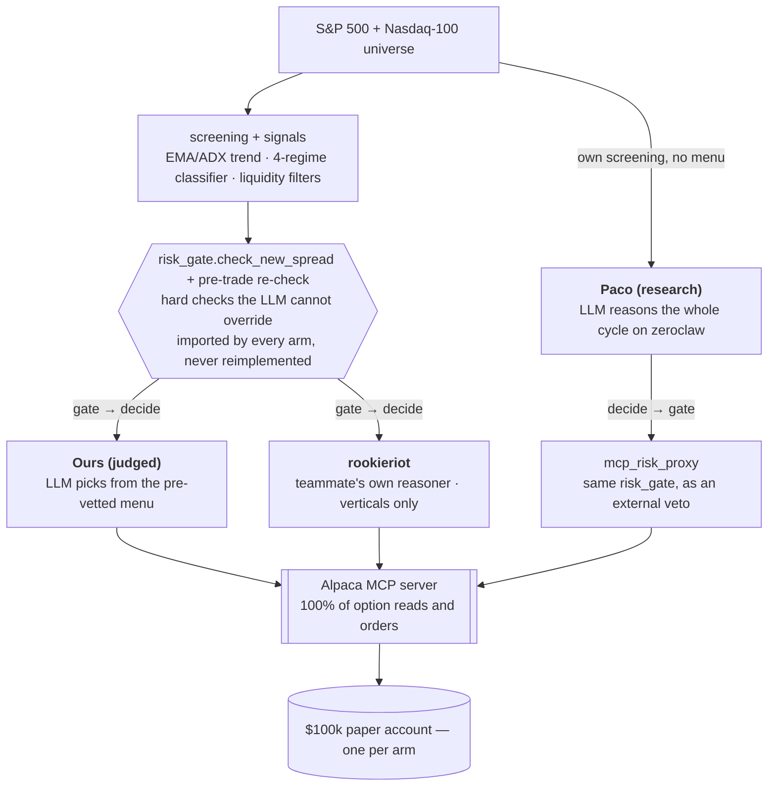
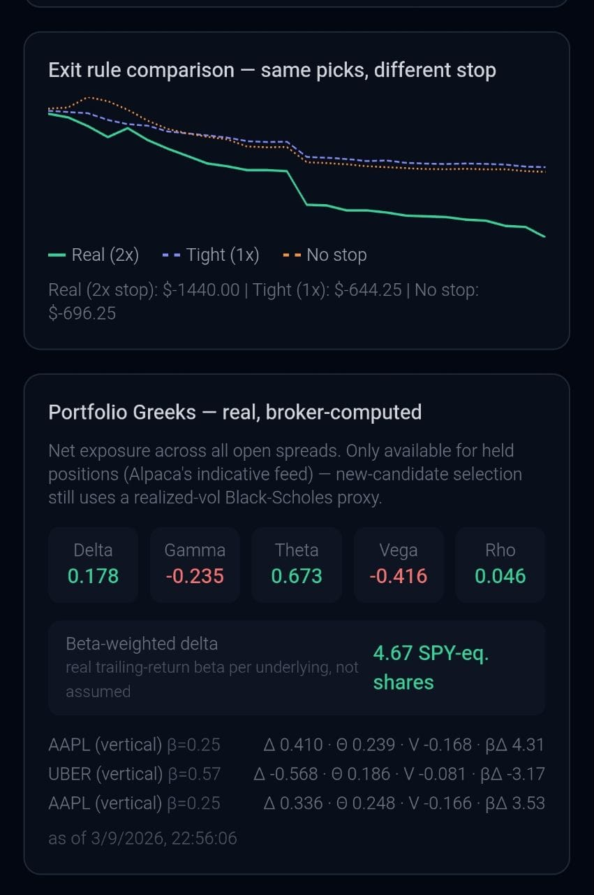

# Alpaca Options Agent — credit spreads, iron condors, debit overlay

[](https://lablab.ai/event/alpaca-ai-trading-agents-hackathon)
[](https://www.python.org/)
[](https://github.com/alpacahq/alpaca-mcp-server)
[](https://alpaca-agent-dashboard.vercel.app)
[](https://alpaca.markets)

Submission for lablab.ai's **Alpaca AI Trading Agents Hackathon**
(28 Aug – 4 Sep 2026).

An autonomous agent that trades **defined-risk options structures** on
liquid US equities and routes between them by market regime:

- a **bull put** / **bear call** credit vertical on a directional signal;
- an **iron condor** when the name is range-bound with no real trend;
- a stricter **directional debit-spread overlay** tried first on
  high-conviction trends (ADX > 35 plus a real signal-strength floor).

Every structure is defined-risk from the moment it opens, sized and gated
by explicit code-level rules an LLM decision layer sees only *after* they
pass and can never override.

**Live dashboard**: https://alpaca-agent-dashboard.vercel.app (also opens
as a Telegram Mini App via [@Alpaca_alejdro_bot](https://t.me/Alpaca_alejdro_bot) — same page, same code, either way).

The judged paper account is **`PA36EFWLOWRF`** (reset to a fresh $100,000
on 2026-08-30 so the track record is measured entirely against the final
rule set — see *Honest scope notes*).

## Three implementations, one backbone

This entry runs **three** autonomous agents at the same goal, sharing the
same underlying-selection and risk math, differing only in the **decision
layer**:



| | Decision layer | Repo | Paper account |
|---|---|---|---|
| **Credit spreads / iron condors / debit overlay**<br>*(ours — judged)* | deterministic `risk_gate.py` clears candidates first; an LLM picks among the survivors and can never override the gate | this one | `PA36EFWLOWRF` |
| **LLM end-to-end**<br>*(Paco — research)* | the LLM runs the whole cycle itself; its only hard rules live in an external MCP proxy it can't see or edit | vendored read-only under [`paco/`](paco/); runs on the zeroclaw agent framework, not from this repo | `PA34KZNBKA4L` |
| **Verticals only**<br>*(rookieriot — independent)* | a teammate's separate build, its own reasoner over the same signal modules | [github.com/massemolle/Alpaca-Trading-rookieriot](https://github.com/massemolle/Alpaca-Trading-rookieriot) | `PA34CFYP0MIZ` |

The dashboard's
[`/compare`](https://alpaca-agent-dashboard.vercel.app/compare) page
overlays all three equity curves against SPY buy-and-hold. Full write-up:
[`docs/STRATEGIES.md`](docs/STRATEGIES.md).

**Main view — 2026-09-03 market close.** Realized P&L, win rate, equity vs.
same-dated SPY, and a shadow-book counterfactual (mechanical rule /
coin-flip / LLM) on the same gate-approved candidates. This is a down
week — see [`ONE_PAGER.md`](ONE_PAGER.md) §Results for the full ledger.


**`/compare` — earlier the same week.** The judged account above its
$100k start (+$55), Paco flat, rookieriot down. The equity has traded on
both sides of $100k across the week; the live dashboard and §Results are
the current truth, not either still frame.


<!-- docs/assets/compare.png — fresh /compare capture taken right before submission; swap in when available -->

**Exit-rule comparison and portfolio Greeks — 2026-09-03.** The shadow
book's real-vs-tight-vs-no-stop equity paths on the same gate-approved
picks, plus real broker-computed Greeks (Alpaca's indicative feed) for
every open spread — the realized-vol Black-Scholes proxy is only used to
screen new candidates, never to report what's already held.



*(Both pages also run as a Telegram Mini App — same code. Every figure
here moves each session; the live dashboard is the source of truth.)*

## How a cycle works

`bot.py`, once per scheduled tick:

1. **Manage open positions** — profit target (30% of credit / of max gain
   for a debit spread), stop (2× credit), force-close if DTE ≤ 1 or the
   contest deadline is within 2 hours.
2. **Reconcile** — compare real Alpaca option legs against the local
   ledger by symbol, quantity *and* signed side, net-aggregated per
   symbol; any mismatch blocks new entries until a human clears it (never
   blocks managing/closing what's already open).
3. **Screen** the S&P 500 ∪ Nasdaq-100 through the vendored liquid-universe
   filters, then the EMA50/200 + ADX trend filter, then a realized-vol
   percentile entry filter (adaptive — relaxes for one cycle if it would
   reject >80% of that cycle's candidates).
4. **Classify regime** per surviving name (`signals/regime.py` — ADX vs 25,
   20d/60d realized-vol ratio vs 1.5×) and route to a structure:
   TRENDING / VOLATILE_TRENDING → vertical (+ debit overlay on the
   strongest trends); RANGING → iron condor (falls back to a vertical if
   the condor can't clear its credit floor); VOLATILE_RANGING → skip.
5. **Build** concrete strikes/expiration via Alpaca's MCP option-contract
   and snapshot tools.
6. **Risk gate** (`risk_gate.py`) — hard, deterministic checks (below). A
   candidate that fails any of them is dropped here, before the LLM.
7. **LLM decision** (`llm_reasoner.py`) — among whatever survived, an LLM
   picks which spread(s), if any, to open within the remaining
   concurrent-spread budget, and produces the reasoning shown on the
   dashboard. Each candidate carries short `fact_ids` (e.g.
   `AAPL_CREDIT_EST`); the model must cite `[FACT_ID]` for every number,
   and uncited/unknown citations are logged.
8. **Execute** via `executor_mcp.py` — marketable limit orders only (no
   worse than 10% slippage off the just-checked credit/debit), with real
   fill confirmation.

A separate **shadow book** runs the same gate-approved candidates through a
mechanical rule policy, a matched-rate random policy, and two LLM
stop-loss variants as virtual positions with real mark-to-market P&L, so
the LLM's selection can be measured against baselines.

## Risk gates — the hard backstop the LLM cannot touch

`risk_gate.check_new_spread` and its callers, all plain Python, applied
before any candidate reaches the model:

- **Daily-loss circuit breaker** — no new spreads once the day's
  realized+unrealized P&L breaches **-3%**.
- **Position caps** — **7** concurrent spreads overall; **2** concurrent
  iron condors *and* a separate **30%-of-equity** aggregate cap on iron
  condor exposure (a 4-leg structure ties up more concentration/liquidity
  budget than a vertical).
- **Per-spread max loss ≤ 2% of equity** — rejected outright, never
  silently resized.
- **DTE window** — currently **7–14** (see *Parameter optimization pass*
  for the unresolved disagreement with our own backtest).
- **Concentration** — **20%** of equity per underlying **and** **40%** per
  correlation cluster (mega-cap tech / big banks / energy majors), because
  several "different" names can be one correlated bet in a stress move.
- **Minimum credit-to-width** — **1/3** for iron condors, **0.05** for
  directional credit verticals (added after a bear-call collecting ~2% of
  its width slipped through; see `config.py`).
- **Post-stop re-entry cooldown** — after a `closed_stop`, the same
  underlying+direction is blocked for **240 min** (a reversed thesis or a
  different name is unaffected).
- **Per-leg liquidity** — bid-ask ≤ 12% of mid; open interest ≥ 100 when
  the feed reports a value.
- **Fresh-quote re-check** immediately before every order — a missing or
  unparseable quote timestamp blocks the trade (fail-closed).
- **`should_force_close`** — unconditional exit at DTE ≤ 1 or contest
  deadline within 2 h, so a late entry can't end the week open and
  undemonstrated.
- **Runtime account guard** — hard-stops if the credentials that resolve
  at runtime ever point at either teammate instance's other judged
  account (after a real cross-account display incident, 2026-08-30).
- **Independent panic paths** — `kill_switch.py` (stops new cycles, leaves
  open positions) and `emergency_flatten.py` (closes everything, with
  confirmation), both independent of the per-cycle gate.

## Data Alpaca doesn't provide — computed in-process, labeled as a proxy

This account's tier (free/`indicative` feed, no Algo Trader Plus) is
missing inputs a fully-provisioned options bot would read from the broker.
Each is computed from data Alpaca *does* provide and labeled as a proxy
everywhere it's surfaced — code, dashboard, this doc — not overclaimed:

- **Delta** — the options snapshot has no `greeks` field on this feed
  (verified live; real Greeks need paid OPRA). `black_scholes.py` computes
  delta in closed form, using realized volatility as the IV input.
- **IV-rank proxy** — no real implied-vol history on this tier. The entry
  filter ranks the current 20-day ATR% against its own trailing year — a
  realized-vol percentile, an explicit proxy for IV rank.
- **VIX proxy** — Alpaca's data API has no `^VIX`. A **VIXY-percentile**
  overlay (VIXY ranked against its own trailing-year range, since VIXY's
  absolute level has no stable relationship to VIX) widens or tightens
  iron-condor strike selection by tertile.
- **Portfolio beta-weighted delta** — `portfolio_greeks.py` computes
  "this book moves like N shares of SPY" from the in-process
  Black-Scholes deltas and a real trailing-return beta per underlying
  (never a hardcoded table). Dashboard monitoring only; never gates a
  decision.
- **Correlation clusters** — `screening/correlation_clusters.py`
  hand-curates three well-documented correlated groups from public
  market-structure knowledge, scoped to the names this universe actually
  surfaces — feeding the cluster cap the per-underlying cap can't catch.

## Current parameters

All in `config.py`, every one env-overridable, defaults explained inline.
Values marked *watching* are deliberate choices not independently
backtested at their current setting — tracked against real per-generation
P&L via the evolution audit trail.

| Parameter | Value | Note |
|---|---|---|
| `short_leg_target_delta` | **0.13** | *watching* — was 0.17; smaller, higher-probability wins. 0.20 was tried in backtest and reverted (strike-rounding delta error on low-priced names). |
| `min_dte` / `max_dte` | **7 / 14** | *pending comparison* — our own walk-forward backtest preferred 10–21; deliberately overridden by the external 3-strategy spec, watching real data as the tiebreaker. |
| `spread_width_dollars` | **5.0** | 10.0 in VOLATILE_TRENDING. Do **not** hand-tune from the evolution dry-run — it flip-flopped 5.8 / 5.7 / 4.2 across three days (overfit on ~5 replayed trades). |
| `profit_target_pct` | **0.30** | close early, recycle capital sooner. |
| `stop_loss_multiple` | **2.0** | excluded from evolutionary mutation. |
| `max_loss_per_spread_pct` | **0.02** | of equity at entry. |
| `max_daily_loss_pct` | **0.03** | circuit breaker. |
| `max_concurrent_spreads` | **7** | volume-over-quality lever; concentration/cluster caps bound the correlation. |
| `max_concurrent_iron_condors` / `max_iron_condor_equity_pct` | **2** / **0.30** | count cap + real equity-% aggregate cap. |
| `min_credit_to_width_pct` (IC) | **0.333** | tastytrade rule of thumb. IC wing width also scales with the underlying's price. |
| `min_vertical_credit_to_width_pct` | **0.05** | *watching* — deadline-pragmatic; the real fix (delta or width) is a post-hackathon question. |
| `max_concentration_pct` / `max_cluster_concentration_pct` | **0.20** / **0.40** | per underlying / per correlation cluster. |
| vol entry percentile | **≥ 0.40** | 20-day ATR%; adaptive relax to 0.25 for one cycle if >80% rejected. |
| `min_open_interest` / `max_bid_ask_spread_pct` | **100** / **0.12** | OI enforced only when the feed returns a real value. |
| `debit_min_adx` / `debit_min_signal_strength` | **35** / **0.40** | the stricter bar the debit overlay must clear before it's tried ahead of the vertical. |
| `stopout_cooldown_minutes` | **240** | post-stop re-entry block, same underlying+direction. |
| screening | `MAX_PRICE` 1500, `MIN_AVG_VOLUME` 100k, `MIN_PRICE` 10, market cap 5e9–2e12, `MIN_ATR_PCT` 0.5 | two loosened 2026-09-02 — see `ScreeningFilters` docstring. |

## Alpaca infrastructure

- **100% of options reads and writes go through Alpaca's official
  [MCP server](https://github.com/alpacahq/alpaca-mcp-server)**
  (`mcp_client.py`, `spread_builder.py`, `executor_mcp.py`) —
  `get_option_contracts`, `get_option_snapshot`, `place_option_order`. The
  raw SDK is never used for anything options-related. `mcp_client.call`
  retries HTTP 429 (rate limit) with exponential backoff so a busy
  screening cycle doesn't drop candidates.
- **Orchestration** — an adaptive cron (2–30 min, tightening near a
  stop-loss, backing off when idle and quiet) via
  [Hermes](https://github.com/), the author's agent-orchestration system,
  reused rather than rebuilt under a deadline.
- **Real-time monitor** — `spread_monitor.py` holds an Alpaca options-data
  WebSocket (msgpack, `v1beta1/indicative`) for open **verticals**,
  started/stopped daily around market hours. Iron condors are deliberately
  excluded (4-leg partial-fill/partial-close risk) and managed by the cron.
- **Store** — Supabase/Postgres in its own isolated schema
  (`alpaca_hackathon`), reached via direct Postgres, not the REST API.
- **Dashboard** — a small Next.js app (`dashboard/`), also a Telegram Mini
  App, reading live state: equity curve, open positions, per-cycle
  reasoning with cited facts, the shadow-book comparison, portfolio Greeks.
- **LLM** — `mimo-v2.5-pro` over an OpenAI-compatible endpoint.

## Operational safety & tooling

- **Reconciliation** (`reconciler.py`) — the independent broker-vs-ledger
  check described in step 2 above.
- **Overnight evolution** (`overnight_evolution.py`) — a nightly job that
  replays the day's candidates against parameter variants and reports what
  it *would* promote. It runs **dry-run only** for the judged week —
  nothing is applied automatically; a real promotion or revert is manual
  (`revert_evolution.py`). Two-layer audit trail: `evolution_history`
  (append-only) + a `generation` column on `cycles`/`spreads` for real
  per-generation P&L.
- **Quiet-market diagnostic** (`quiet_market_report.py`) — an end-of-day,
  report-only summary of "did the machinery do anything today" (triggers
  on a ≤ 2-trade day), piggybacked on the evolution cron's Discord message.
- **Chaos tests** — `test_*.py`, run as scripts (`python3 test_x.py`, not
  pytest). Each category defends a real bug already fixed.

## Running it

```
python3 -m venv .venv && source .venv/bin/activate
pip install -r requirements.txt
cp .env.example .env        # the dedicated hackathon Alpaca account's keys + Supabase + LLM endpoint
python smoke_test.py SPY    # confirm MCP + options data + a $100k account, before anything else
python bot.py               # one cycle, manually
```

Scheduled execution: `run_options_cron.sh` (Hermes cron job) and
`run_spread_monitor.sh` (the WebSocket monitor, gated to market hours).

## Files

| Path | Role |
|---|---|
| `bot.py` | The cycle: manage → reconcile → screen → regime-route → gate → LLM decide → execute |
| `spread_builder.py` | Signal + regime → concrete strikes/expiration via MCP (verticals, iron condors, debit spreads) |
| `risk_gate.py` | Hard, deterministic entry checks + `should_close` / `should_force_close` |
| `llm_reasoner.py` | The decision step among gate-approved candidates, with fact-citation |
| `executor_mcp.py` | Opens/closes every structure, exclusively via Alpaca's MCP server |
| `mcp_client.py` | Async wrapper spawning `alpaca-mcp-server` over stdio, with 429 backoff |
| `black_scholes.py` | In-process delta (no broker Greeks on this feed) |
| `reconciler.py` | Independent broker-vs-ledger reconciliation each cycle |
| `spread_monitor.py` | Real-time WebSocket P&L monitor for open verticals |
| `portfolio_greeks.py` | Beta-weighted portfolio delta (monitoring only) |
| `shadow_book.py` | Mechanical / random / LLM-variant policies on the same candidates |
| `overnight_evolution.py`, `revert_evolution.py`, `evolution_config.py` | Nightly parameter-replay (dry-run) + manual promote/revert |
| `quiet_market_report.py` | End-of-day report-only "quiet day" diagnostic |
| `kill_switch.py`, `emergency_flatten.py` | Independent panic paths |
| `db.py` | Live state to Supabase for the dashboard |
| `config.py` | Every tunable, env-overridable, defaults explained inline |
| `screening/`, `signals/` | Vendored from `trading_bot/` — day/swing signals, EMA/ADX trend filter, regime classifier, liquid-universe filters, correlation clusters |
| `dashboard/` | Next.js web + Telegram Mini App |
| `paco/` | The research arm, vendored read-only (runs on zeroclaw, not from here) |
| `docs/STRATEGIES.md` | The three-implementation write-up |
| `ONE_PAGER.md` | The judged one-pager (hypothesis, architecture, results, scope) |

## Parameter optimization pass (`backtest_optimize.py`)

Run once, 2026-08-27, before the first live trading day. Reuses the real
signal scoring (a documented frozen port of `signals.swing`), the real
`TrendFilter`, and the real volatility-percentile filter against real
historical daily bars — but simulates spread economics with Black-Scholes
theoretical pricing on the same realized-vol proxy the live bot uses,
since real historical option chains aren't available on this account. It
is **not** a market-realistic options backtest, and doesn't model the
portfolio cap or the LLM selection step.

Two findings, handled honestly:

- **DTE 10–21 beat 7–14** on a 12-symbol basket over ~2 years (104 entry
  events) — a large, sign-flipping difference, not marginal. This was then
  **deliberately overridden** by the external 3-strategy spec's 7–14
  window; the finding was never invalidated, and real per-generation P&L
  under 7–14 is the tiebreaker being watched.
- **`short_leg_target_delta` 0.17 → 0.20** initially looked better (win
  rate 80.8% vs 78.8%), but a synthetic-case sanity pass found the
  strike-rounding step (round the BS-implied strike to the nearest $1, a
  disclosed proxy for a real listed-strike ladder) carries up to ~34–47%
  relative delta error at the 15-day midpoint for lower-priced names —
  the same order of magnitude as the result itself. That result was
  **reverted**; delta later moved 0.17 → **0.13** in the opposite
  direction (smaller, higher-probability wins) as a modest, deliberately
  un-leapt step.

## Honest scope notes

- **Account reset 2026-08-30.** The account used since kickoff was replaced
  with a fresh $100,000 paper account after several risk-gate/parameter
  changes landed mid-week, so the judged track record is measured against
  the final rule set, not a mix. `PA36EFWLOWRF` is the submission-form
  account.
- **No broker-supplied Greeks.** `feed=opra` 403s ("OPRA agreement is not
  signed"); the free `indicative` feed's snapshot has no `greeks` key.
  Delta is `black_scholes.py` with a realized-vol IV proxy — a standard
  substitution, disclosed everywhere.
- **`open_interest` is frequently `null`** on this account/feed, even for
  liquid near-the-money SPY strikes — the liquidity gate enforces it only
  when a real value comes back and leans on the bid-ask-spread check.
- **Realized vol ≠ implied vol; VIXY ≠ VIX.** Both are used as explicit
  percentile-based proxies, labeled as such, never presented as the real
  measure.
- **Every field-name / parameter-shape assumption** (MCP response nesting,
  `qty`/`ratio_qty` as strings, `position_intent` per leg) was verified
  against the real account's actual responses — several first guesses were
  wrong and are visible in git history next to their fixes.
- **The LLM can decline a gate-approved candidate; it can never open one
  the gate rejected.** That asymmetry is intentional.
